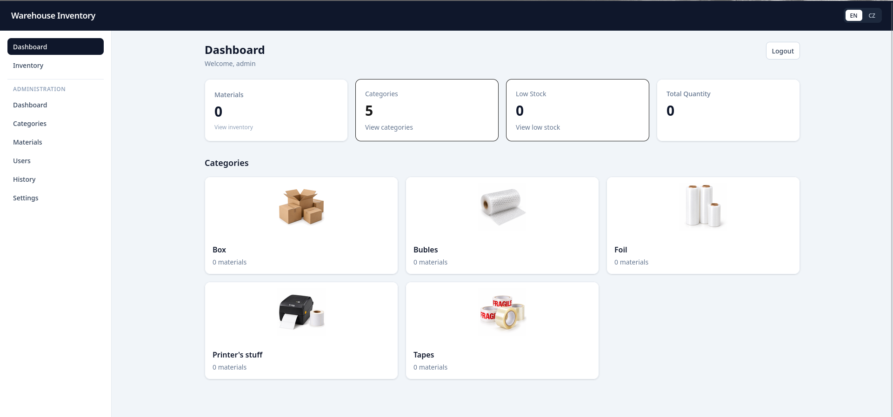
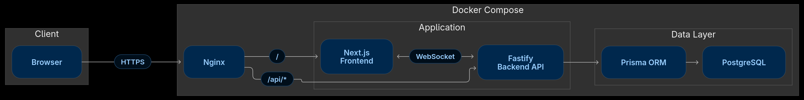

# Warehouse Inventory

[](https://github.com/Tarbox/warehouse-inventory/actions/workflows/ci.yml)
[](LICENSE)

A full-stack warehouse inventory management system for tracking consumable materials, stock levels, users, and inventory changes.

Built as a portfolio-quality systems project, it demonstrates authentication, role-based authorization, transactional inventory updates, concurrency control, audit history, realtime events, Docker, PostgreSQL, Prisma, and Nginx.

## Project Preview



_Illustrative preview of the product and its technical focus._

## Overview

Warehouse Inventory is designed around a simple operational workflow:

**Dashboard → Category → Inventory → Stock operation → Audit history**

The application supports both everyday warehouse workflows and administrative operations such as user, category, material, and system-settings management.

## Features

### Inventory

- Inventory browsing, filtering, sorting, and low-stock detection
- Increment/decrement stock operations
- Exact quantity updates with optimistic version checks
- Concurrent update protection using PostgreSQL row locking
- Inventory change history and audit records

### Authentication & authorization

- Server-side sessions stored in PostgreSQL
- HttpOnly session cookies
- Argon2id password hashing
- Role- and permission-based authorization
- Session expiration
- Disabled-user handling
- Login rate limiting
- Origin validation for state-changing requests

### Realtime

- WebSocket-based realtime updates
- Typed inventory/material/category events
- Client-side protection against stale inventory events

### Administration

- User management
- Category CRUD
- Material CRUD
- System settings
- Inventory history

### Infrastructure

- Dockerized frontend, backend, and PostgreSQL
- Docker Compose development and test environments
- Separate production Compose configuration
- Nginx reverse proxy
- Development HMR and WebSocket proxying
- CI validation for application and infrastructure configuration

## Architecture



Realtime updates use WebSocket connections between the browser and backend.

See [docs/architecture.md](docs/architecture.md).

## Tech Stack

| Area | Technology |
| --- | --- |
| Frontend | Next.js 16, React 19, TypeScript, Tailwind CSS |
| Backend | Node.js, Fastify, TypeScript, Zod |
| Database | PostgreSQL 18 |
| ORM | Prisma 7 |
| Authentication | Argon2id + server-side sessions |
| Realtime | WebSocket |
| Infrastructure | Docker, Docker Compose, Nginx |
| Testing | Vitest |
| CI | GitHub Actions |

## Repository Structure

```text
warehouse-inventory/
├── backend/
│   ├── prisma/
│   │   ├── migrations/
│   │   └── seed.ts
│   └── src/
├── frontend/
│   ├── public/
│   └── src/
├── nginx/
├── docs/
├── scripts/
├── .github/
│   └── workflows/
├── .env.example
├── docker-compose.yml
├── docker-compose.prod.yml
├── docker-compose.test.yml
└── README.md
```

# Quick Start

The recommended way to run the project locally is the Docker-based development stack.

## Requirements

Install:

- Git
- Docker Engine
- Docker Compose
- Node.js 24+
- npm

The application services run in Docker. Node.js/npm are needed for Prisma migrations, seeding, and optional host-side development commands.

## 1. Clone

```bash
git clone https://github.com/Tarbox/warehouse-inventory.git
cd warehouse-inventory
```

## 2. Configure environment

Create the Docker environment:

```bash
cp .env.example .env
```

Create the backend host environment used by Prisma:

```bash
cp backend/.env.example backend/.env
```

Use the same `SEED_ADMIN_PASSWORD` and `SEED_WORKER_PASSWORD` values in both files.

Do not commit either file.

## 3. Start the application stack

```bash
docker compose up -d --build --wait
```

This starts:

- PostgreSQL
- Fastify backend
- Next.js frontend
- Nginx reverse proxy

The development stack exposes:

| Service | Host |
| --- | --- |
| Application | http://localhost:8080 |
| PostgreSQL | localhost:5433 |

## 4. Install backend tooling

```bash
cd backend
npm ci
npx prisma generate
```

## 5. Apply database migrations

```bash
npx prisma migrate deploy
```

## 6. Seed demo data

```bash
npx prisma db seed
cd ..
```

The seed creates local `admin` and `worker` accounts.

## 7. Open the application

Open:

**http://localhost:8080**

The development Nginx configuration also proxies Next.js HMR and WebSocket traffic.

## Demo Accounts

The seed creates:

| User | Role | Password |
| --- | --- | --- |
| `admin` | ADMIN | value of `SEED_ADMIN_PASSWORD` |
| `worker` | WORKER | value of `SEED_WORKER_PASSWORD` |

Use local/demo passwords only. Never reuse them in production.

# Testing

Backend tests use a dedicated PostgreSQL test database.

## Backend tests

From the repository root:

```bash
docker compose -f docker-compose.test.yml up -d --wait

cp backend/.env.test.example backend/.env.test

cd backend
npm ci
npx prisma generate
npx prisma migrate deploy
npm test
```

The test database is exposed on `localhost:5434`.

The clean-clone test workflow has been verified with the repository's current setup, including the backend test suite.

## Frontend checks

```bash
cd frontend
npm ci
npm run lint
npm run typecheck
npm run build
```

## CI

GitHub Actions validates:

- backend dependency installation
- Prisma client generation
- database migrations
- backend build
- backend tests
- frontend linting
- frontend type checking
- frontend build
- Docker image builds
- Docker Compose configuration
- development Nginx configuration
- production Nginx configuration

See [.github/workflows/ci.yml](.github/workflows/ci.yml).

# Environment

Never commit real secrets.

### Docker Compose

The root `.env.example` defines:

- `POSTGRES_DB`
- `POSTGRES_USER`
- `POSTGRES_PASSWORD`
- `CORS_ORIGIN`
- `SEED_ADMIN_PASSWORD`
- `SEED_WORKER_PASSWORD`

### Backend

`backend/.env.example` is used for host-side Prisma/Node commands.

`backend/.env.test.example` is used for the dedicated test database.

See [docs/environment.md](docs/environment.md).

# Security

The application includes:

- server-side sessions
- Argon2id password hashing
- HttpOnly cookies
- SameSite protection
- origin validation for mutating requests
- login rate limiting
- authorization middleware
- session expiration
- disabled-user handling
- Nginx security headers

See [SECURITY.md](SECURITY.md).

## Reporting security issues

Please follow the process described in [SECURITY.md](SECURITY.md).

# Concurrency & Data Integrity

Inventory updates are designed to prevent lost updates.

- Increment/decrement operations lock the inventory row inside a database transaction.
- Exact quantity updates require the expected inventory version.
- Stale writes return `409 VERSION_CONFLICT`.
- Inventory changes are recorded in the audit history.

See [docs/architecture.md](docs/architecture.md).

# Production Deployment

Development and production are intentionally separated.

The production stack is defined in [docker-compose.prod.yml](docker-compose.prod.yml) and uses [nginx/nginx.prod.conf](nginx/nginx.prod.conf).

A production deployment requires:

- production environment variables and secrets
- trusted TLS certificates
- PostgreSQL backups
- restricted network access
- monitoring and log collection
- an image update strategy

TLS certificates are mounted from:

```text
nginx/certs/fullchain.pem
nginx/certs/privkey.pem
```

Production PostgreSQL is not published outside the Compose network.

Database migrations and seeding must be run from an environment that has Prisma CLI tooling and network access to the production database.

# Common Commands

Start development:

```bash
docker compose up -d --build --wait
```

Stop development:

```bash
docker compose down
```

Stop development and remove local volumes:

```bash
docker compose down -v
```

View logs:

```bash
docker compose logs -f
```

Check service status:

```bash
docker compose ps
```

Start the test database:

```bash
docker compose -f docker-compose.test.yml up -d --wait
```

# Documentation

| Document | Description |
| --- | --- |
| [Architecture](docs/architecture.md) | Application boundaries and system design |
| [Environment](docs/environment.md) | Environment variables and configuration |
| [API](docs/api.md) | API documentation |
| [Security Policy](SECURITY.md) | Security reporting and policy |

# Warehouse Inventory 2.0 Roadmap

The next major version is planned around real warehouse workflows rather than isolated feature additions.

| Phase | Priority | Planned outcome |
| --- | --- | --- |
| 01 — Roles & RBAC | Critical | Granular roles and permissions for Employee, Inventory Operator, Manager, and Admin |
| 02 — Material Requests | Critical | Employees can request materials without directly changing stock |
| 03 — Receiving & Issuing | Critical | Controlled receiving and issuing workflows managed by Inventory Operators |
| 04 — Transactions & History | Critical | Immutable inventory transactions and complete traceability |
| 05 — Packaging & Units | High | Base units, packaging units, and automatic quantity conversion |
| 06 — Employee Experience | High | Simple warehouse-focused interface for requests and availability checks |
| 07 — QR Workflow | Medium | QR-based access to materials and storage locations |
| 08 — Statistics & Analytics | High | Consumption statistics, trends, usage, and inventory analytics |
| 09 — Manager Dashboard | Medium | High-level stock, consumption, trends, and operational metrics |
| 10 — Notifications | Medium | Alerts for requests, low stock, empty shelves, and unusual usage |
| 11 — Reports | Medium | Inventory, consumption, receiving, issuing, and history reports with export |
| 12 — Forecasting & Reorder | Low | Stock coverage, reorder points, and replenishment planning |
| 13 — Advanced Warehouse | Low | Suppliers, purchase orders, departments, locations, transfers, and advanced analytics |

The roadmap is intentionally incremental: critical warehouse workflows come first, followed by employee experience, visibility, automation, and advanced planning.

# Project Status

The project is maintained as a documented portfolio/open-source baseline.

The current release baseline is `v1.0.0`. Future work may include material request workflows, QR-based workflows, richer reporting, OpenAPI documentation, and broader end-to-end coverage.

# License

MIT License. See [LICENSE](LICENSE).
